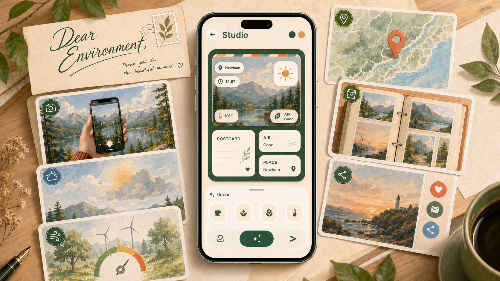
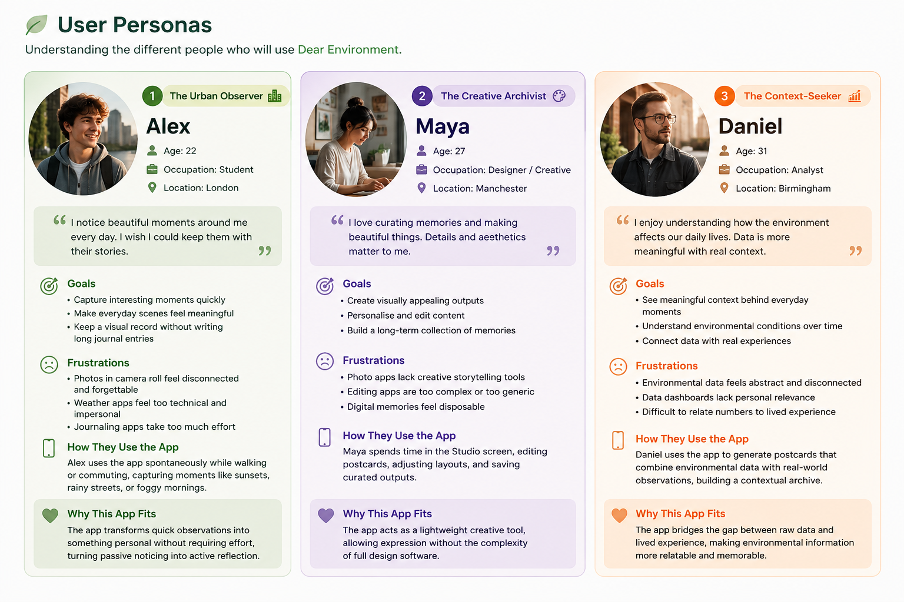
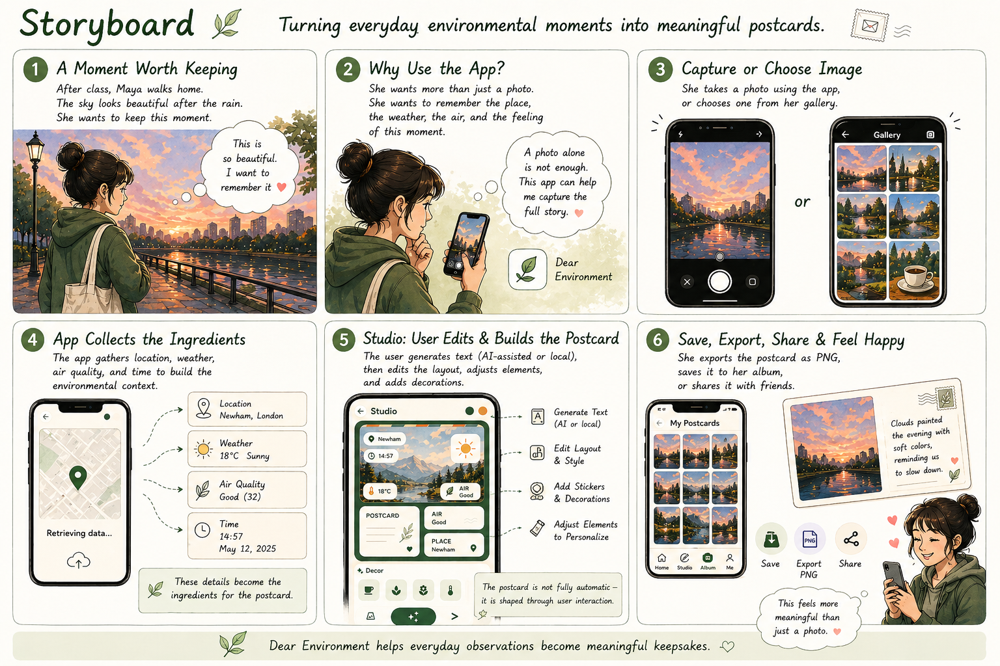
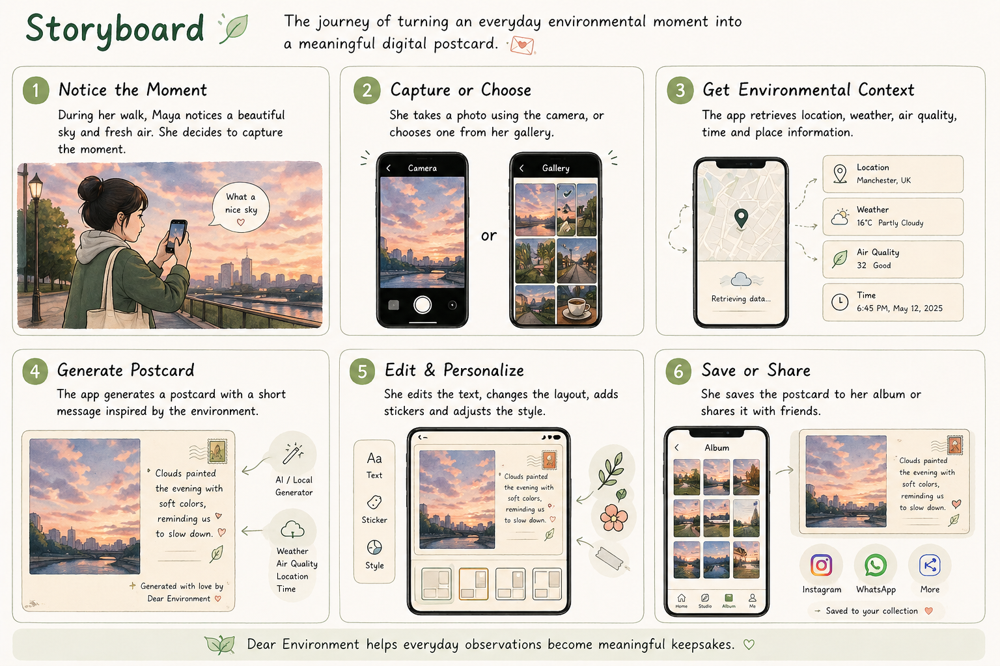
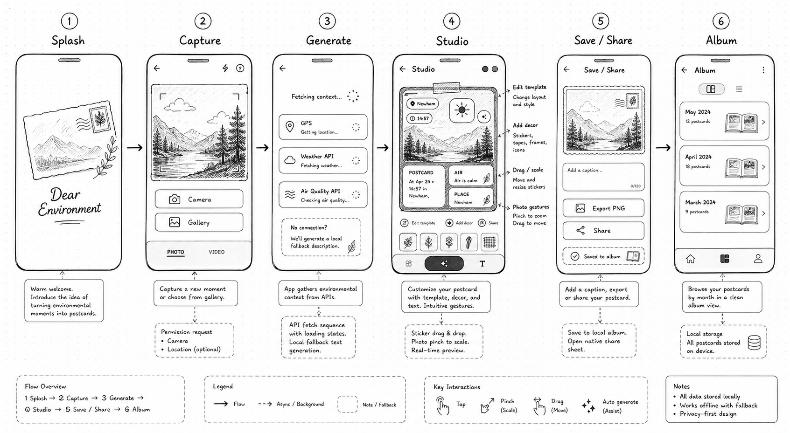

# Dear Environment

**A mobile app that turns everyday environmental moments into tiny digital postcards.**

> Notice the sky.\
> Capture the moment.\
> Let the environment write back.



---

## Overview

**Dear Environment** is a Flutter mobile application that turns real-world environmental moments into editable digital postcards.

The app does not simply take a photo and automatically output a finished image. Instead, it collects environmental context and turns it into creative material that the user can arrange, decorate, save, and share.

Users can capture or select a photo, retrieve live context such as location, weather, air quality, and time, generate postcard writing and social captions, then customise the result in an interactive Studio.

In simple terms:

**photo + place + weather + air quality + generated text + user editing = one environmental keepsake**

The project explores how mobile sensing, API-based services, and interactive design can make the physical environment feel more personal, visible, and memorable.

---

## Problem Statement

Mobile devices constantly collect environmental data, but this information is often fragmented across multiple applications and presented in purely functional ways.

As a result:

- environmental context is rarely experienced as meaningful
- users do not actively reflect on their surroundings
- data is consumed passively rather than creatively

This project addresses this gap by transforming environmental data into a **creative, user-driven artifact**. The user is not just receiving data; they are composing a small visual memory from it.

---

## Understanding the User

### Personas



These personas define target users and guide design decisions around emotional value, clarity, and repeat use.

### Scenario / Storyboard



The storyboard illustrates how a user notices an environmental moment, captures it, edits the generated postcard, and stores it as part of a growing archive.

---

## How the App is Used



1. Open the app and view the animated splash screen.
2. Capture a photo or choose one from the gallery.
3. Generate live environmental context.
4. Review the generated postcard text, metadata, and visual style.
5. Customise the postcard in Studio.
6. Add or move environmental stickers.
7. Adjust the photo position and scale.
8. Change the template or social caption.
9. Save the postcard to the Album, export it as PNG, or share it.

Users can create multiple postcards over time, building a personal collection of environmental moments.

---

## Interaction & Features

### Key Interactions

- take a photo using the camera
- select an image from the gallery
- request GPS location
- fetch weather and air quality data
- reverse geocode coordinates into a readable place
- generate postcard text from environmental context
- generate multiple social captions
- select visual templates
- add contextual stickers
- drag, scale, and delete stickers
- drag and scale the photo inside the postcard
- copy or change generated captions
- render the postcard as a PNG
- save postcards to a local Album
- share the rendered postcard through the native share sheet

### Prototype / UI Exploration



The prototype explored the app as an interactive composition flow rather than a one-click image generator. This shaped the final Studio interaction, where generated environmental material becomes editable content.

---

## System & Technical Design

### Architecture Overview

- **Input:** camera/gallery image, GPS location, time, API data
- **Processing:** environment collection, photo palette analysis, text generation, style generation
- **Interaction:** template selection, sticker editing, photo adjustment, caption controls
- **Output:** rendered postcard PNG, local archive, native sharing

### Data Flow

Capture / Select Image -> Location -> Weather + Air Quality APIs -> Text + Style Generation -> Studio Editing -> Save / Export / Share

### Main Screens

- **LaunchSplashPage** - animated postcard-themed splash screen
- **CapturePage** - photo input and postcard generation
- **StudioPage** - postcard editing, template selection, decor tools, caption/share controls
- **ArchivePage** - saved postcard Album grouped as monthly booklets
- **AlbumDetailPage** - detailed saved postcard view

### External Services

- **Open-Meteo Weather API**
- **Open-Meteo Air Quality API**
- **Reverse geocoding**
- **Optional remote LLM endpoint**

The text generation system supports a remote LLM endpoint through `LLM_ENDPOINT` and `LLM_API_KEY`. If no endpoint is configured or the request fails, the app uses a local fallback generator so the postcard workflow still works.

---

## Connected Environment

The project connects:

- **User to environment** - capturing real-world moments
- **Device to sensors** - camera, GPS, touch, time
- **App to services** - weather, air quality, reverse geocoding, optional LLM
- **Data to creativity** - turning environmental readings into text, style, stickers, and captions
- **User to time** - building a local archive of saved postcards

This creates a connected system where environmental data becomes interactive and personal.

---

## Onboard Interaction

### Device Features

- camera
- GPS
- touch gestures
- gallery access
- local storage
- native share sheet

### Environmental Context

- weather condition
- temperature
- air quality index
- place name
- local time
- photo colour mood

---

## Technical Stack

- **Framework:** Flutter 3.38.6 stable
- **Language:** Dart 3.10.7
- **App version:** 1.0.0+1
- **Package name:** `envpostcard_everyday`
- **Android applicationId:** `com.example.envpostcard_everyday`

### Main Packages

- `http` - API requests
- `geolocator` - GPS location
- `geocoding` - reverse geocoding
- `image_picker` - camera and gallery input
- `shared_preferences` - local postcard metadata storage
- `path_provider` - app documents directory for exported PNG files
- `share_plus` - native sharing
- `google_fonts` - typography
- `palette_generator` - photo colour palette analysis
- `intl` - date and time formatting

---

## Testing

The current project has been checked with Flutter's static analysis and widget test tools.

### Automated Checks

```bash
flutter pub get
flutter analyze
flutter test
```

Current results:

- `flutter pub get` - completed successfully
- `flutter analyze` - no issues found
- `flutter test` - all tests passed

### Widget Test Coverage

The current widget test checks that:

- the app starts on `LaunchSplashPage`
- the splash screen finishes after its timed animation
- the app transitions to the Capture screen
- the Capture view contains the expected capture UI icon

### Manual Testing Focus

- camera and gallery image input
- location permission handling
- weather and air quality API responses
- fallback behaviour when remote text generation is unavailable
- Studio template switching
- sticker add, drag, scale, and delete interactions
- photo drag and scale adjustment
- caption change and copy controls
- PNG export through `RepaintBoundary`
- save-to-Album flow
- native share flow
- Album refresh and saved postcard viewing

---

## Installation

For developers who want to run or extend the project.

### Requirements

- Flutter SDK 3.x
- Dart SDK
- Android Studio or VS Code
- Android emulator or physical Android device

### Run

```bash
flutter pub get
flutter run
```

### Optional LLM Endpoint

The app works with its local text fallback by default. To use a remote text generation service, provide:

```bash
flutter run --dart-define=LLM_ENDPOINT=your_endpoint --dart-define=LLM_API_KEY=your_key
```

### Build

```bash
flutter build apk --release
flutter build appbundle --release
```

---

## Data Handling

The app uses:

- selected image paths
- rendered postcard image paths
- location labels
- weather data
- air quality data
- generated postcard text
- generated social captions
- style and sticker metadata
- saved postcard timestamps

Postcard metadata is stored locally using `shared_preferences`. Rendered postcard PNG files are saved in the app documents directory. Users decide when to save or share a postcard.

---

## Future Improvements

- richer editing tools
- map-based archive
- cloud sync
- iOS deployment and testing
- more environmental data sources
- stronger remote AI integration
- custom app icon and release signing
- expanded widget and integration tests

---

## License

This project is for academic use.

---

## Contact

- GitHub: your-repo-link
- Email: <your-email@example.com>

---

## Final Note

**Dear Environment** is a small app about noticing the world and keeping it, one editable postcard at a time.
